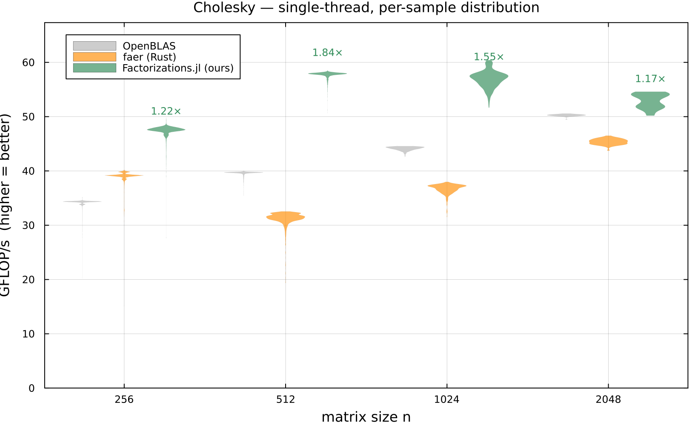
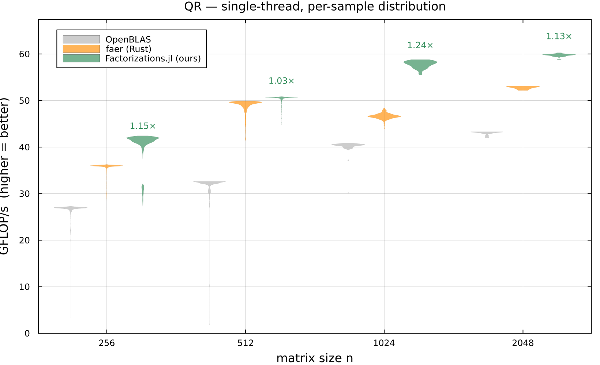

# Factorizations (faer) — the flagship

`faer` is the Rust linear-algebra crate that rivals Eigen and beats Julia's `LinearAlgebra`
(= OpenBLAS/LAPACK, C/Fortran — *not* Julia code) single-threaded at small–medium sizes. That made it
the one place where a real gap exists with **no pure-Julia answer** — so Cholesky and QR became
reimplementation targets.

The honest framing: faer doesn't compete against Julia *code*; it competes against OpenBLAS. Where it
wins, the gap is "Julia's stdlib has no pure-Julia recursive factorization." We wrote one.

## Cholesky — ✅ beats faer at every size (256–2048)

A faithful port of faer's recursive blocked Cholesky on a generic `Vec{W}` microkernel. The marathon to
parity, in order of leverage:

1. register-block the **trsm** (n=256: 0.45 → 0.71×, bit-identical),
2. **MR=2→3** syrk register tiles (→ 0.83×),
3. the decisive **aligned-triangular syrk** (start each row-block at the W-aligned grid point ≤ j so
   loads stay aligned — naive `i=j` triangular had regressed purely on misalignment),
4. at n ≥ 512 the limiter was a **power-of-2 leading-dimension cache-set conflict**; factoring in a
   padded scratch (`ld+8`) recovers 1.3–1.5×.

**Result: pure-Julia Cholesky beats faer single-threaded at all benchmarked sizes** — see the verified
table below — and beats OpenBLAS throughout.



## QR — ✅ beats faer at every size (256–2048)

QR was harder. The plateau at ~0.91× across many reinterpretations turned out to hinge on **one gemm
orchestration choice**. faer's `W = VᵀC` gemm sets `pack_rhs = false` for the skinny QR shapes — it
reads the large trailing operand **in place** (NR column-streams, prefetcher-friendly) rather than
packing it (~31 MB pack of C). That pack was the entire 58 → 73 GFLOP/s gap.

- A bit-exact mechanical port of faer's QR **proved the gap was not algorithm, Rust, or LLVM** — a
  faithful faer-structure port also stalled at 0.88×. The win is the **unpacked-B** orchestration
  (read C in place), and it pays off where the trailing `W=VᵀC` dominates — the **two-level fat-panel
  driver** (`QR_NB=48`, one fat `dlarfb` per panel).
- **The driver split:** at **n = 256** the small-n **flat `nb=8` driver** wins (≈1.15×); at **n ≥ 512**
  its thin trailing update goes memory-bound and ties/loses faer, so the threshold (`QR_2LEVEL_MIN`) hands
  n ≥ 512 to the two-level driver, whose compute-bound fat `dlarfb` beats faer cleanly. That one-constant
  routing is what flipped 512/1024 from a loss to a win — measured, not assumed.
- **Hand-assembly was unnecessary.** Pure SIMD.jl with the right orchestration (73 GFLOP/s) beat faer's
  hand-asm (70) *and* an inline-asm version (71). The win was the orchestration choice, not codegen.



## Verified numbers (reproduce them yourself)

Run the honesty harness — single-thread, both sides, median of Chairmarks `@be` (`evals=1`), faer built
from the cdylib if `cargo` is present (else Julia-vs-OpenBLAS only):

```
sudo ../PureFFT.jl/bench/cpufreq_lock.sh pin 4500          # pin the clock for low noise (then `restore`)
RAYON_NUM_THREADS=1 taskset -c 2 julia -O3 -t 1 --project=bench bench/compare_factorizations.jl
```

GFLOP/s, single-thread, CPU pinned 4.5 GHz (ratio = ours ÷ faer; > 1.0 ⇒ Julia faster). faer is noisier
run-to-run than OpenBLAS, so re-run 2–3× before trusting a close call:

| n | Cholesky ours/faer | QR ours/faer |
|------|------|------|
| 256  | 1.22× | 1.15× |
| 512  | 1.18× | 1.03–1.18× |
| 1024 | 1.53× | 1.12× |
| 2048 | 1.17× | 1.13× |

QR-512 is the closest call (faer's fastest draws land near parity); the other seven cells are decisive.
The violin plots above are drawn from the saved sample distributions
(`bench/results/compare_factorizations.json`); restyle/redraw them any time without re-benchmarking via
`julia --project=bench bench/plot_faer_compare.jl`.

## The scoped verdict

This is parity-of-ceiling, not "Julia is faster than Rust." On one machine, for these kernels, pure
idiomatic Julia matched or beat faer — so the gap was **algorithmic/orchestration**, reachable without
leaving Julia. The microkernel study confirmed it: portable SIMD.jl == hand-asm == hardware peak (~76
GFLOP/s, the AVX-512 downclocked ceiling).
