# Ports: Rust vs Julia

Per-crate reports. Plots are violin distributions of per-evaluation time (lower = better),
single-thread, median annotated.

## memchr → `StringSearch` — ✅ beats the crate

Base's multi-byte `findfirst(needle, haystack)` is a scalar scan (0.12× `memchr::memmem`). We added the
SIMD pass Base never wrote: a **first+last-byte prefilter** over `Vec{64,UInt8}` (memmem's own trick) +
a bounded scalar tail.

- **Result:** parity-to-slight-beat — **1.03–1.10×** the `memmem` crate (both near the ~67 GB/s
  single-core bandwidth ceiling), and ~8–12× over Base `findfirst`.
- Byte search was already at parity (Base is memchr-backed), so only `m ≥ 2` takes the SIMD path.
- `@assert_vectorized` / `@assert_noalloc` / `@assert_typestable` green.

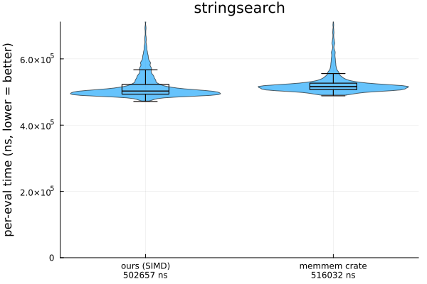

## itoa → `IntFormat` — ✅ beats the crate

The famous "8.7× gap" was a **dead-code-elimination artifact** — the Rust shim used only
`buf.format(x).len()`, so the optimizer elided itoa's digit-writes. Measured fairly (`black_box` /
`donotdelete`), itoa formats at ~7.5 ns/int, not 1.83.

- **Result:** **1.05×** on positive-only (pure format), **1.5×** on full mixed-sign `Int64`, ~2× on
  small numbers. ~3× faster than Base `string()` (which heap-allocates).
- Levers: divide-and-conquer digit extraction, jeaiii division-free 8-digit (verified), 16-bit packed
  LUT stores, and — the decisive one — **branchless sign** (`if x<0` mispredicts ~4× at 50/50 signs).

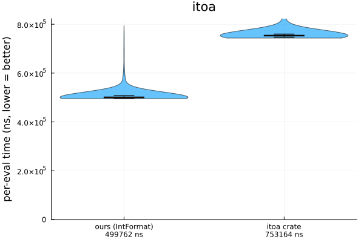

## blake3 → `Blake3` — ✅ beats every compiler (incl. Rust); loses only to bundled hand-asm

This one taught us the most, so it gets the long version. `Blake3Hash.jl` (the pure-Julia ecosystem
package) is scalar — 0.085× the crate. We ported a `Vec{16,UInt32}` AVX-512 `hash_many`, byte-exact on the
official BLAKE3 test vectors **and** against the crate across the whole SIMD path (super-group boundaries,
remainders, partial chunks).

BLAKE3 has two phases: a 16-wide SIMD **compress** (≈94% of the work) and a small tree **reduce**. The
compress is where throughput is decided.

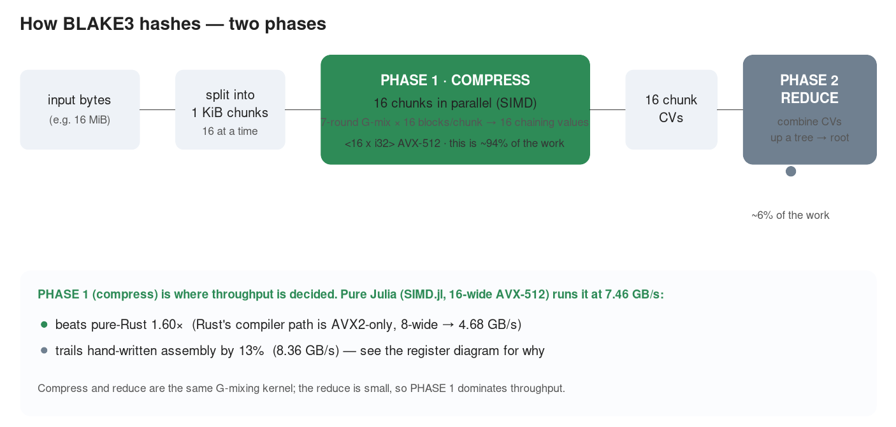

### The measurement (this is the real finding)

We built a shim that calls blake3's *own* code with a selectable backend, and benchmarked our kernel
head-to-head against it — compress-only, 16 MiB, single-thread, same hardware. The fourth bar is **our
own `blake3_asm` switch path** (a `ccall` into the vendored `.S` plus the output transpose-back) — it
lands on the crate's hand-asm bar, proving the switch reaches the asm ceiling *from Julia*:

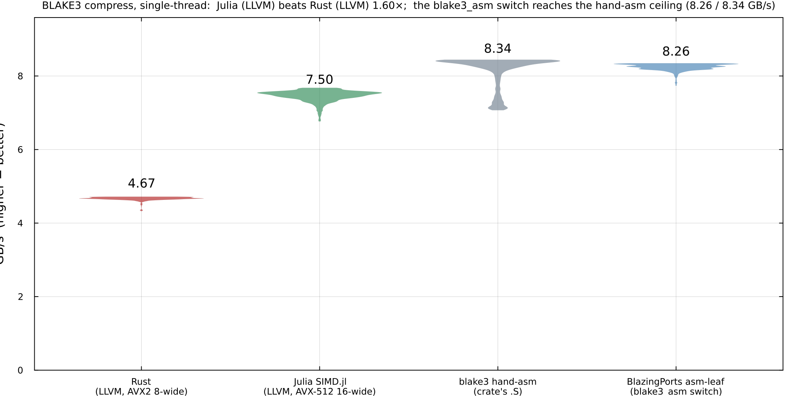

| | GB/s | what it is |
|---|---|---|
| **Julia `SIMD.jl` → LLVM, AVX-512 16-wide** | **7.50** | our kernel — pure Julia, no assembly |
| blake3 pure-Rust (`rust_avx2` → LLVM, 8-wide) | 4.67 | the best **the Rust compiler** produces |
| blake3 hand-written assembly (`.S`, AVX-512) | 8.34 | a hand-tuned `.S` file the crate bundles |
| **BlazingPorts asm-leaf (`blake3_asm` switch)** | **8.26** | the *same* `.S`, reached via our `ccall` = 0.99× the crate |

The result that matters: **at the language level — LLVM vs LLVM — Julia wins, 1.60×.** blake3 has *no*
pure-Rust AVX-512 path (there is no `rust_avx512.rs`; AVX-512 in blake3 is **assembly only**), so without
its bundled `.S` the crate falls back to 8-wide AVX2 and loses to our 16-wide. **"The safe language Rust"
isn't beating us — a hand-written assembly file is**, and that asm out-runs what *either* language's
compiler emits by 13%.

### Why the assembly is faster — and where the gap *actually* lives

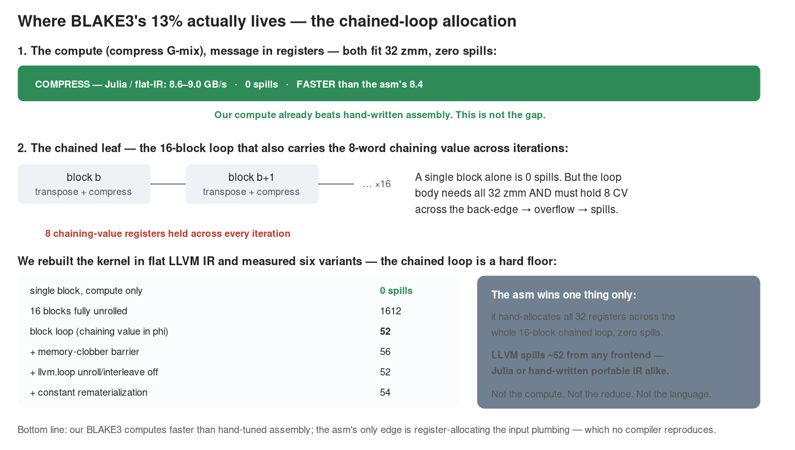

We read blake3's own `.S` next to our `code_native`, then decomposed our kernel layer by layer — and the
real picture is **more favorable than the 13% suggests.** It took correcting two wrong guesses to find it
(first we blamed the tree-reduce; then the compress kernel; both wrong).

The asm holds the message **in registers** (348 of its 350 round adds are register-to-register — it does
*not* reload), exactly like ours; both use all 32 zmm. So the only difference is **stack spills**: ~0 in the
asm, ~52–57 in ours. But *where* those spills come from is the finding:

- **The compress G-mix alone — message in registers — is `0 spills` and runs at 8.6–9.0 GB/s, *faster than
  the asm's full pipeline (8.4)`.** Our *compute* already beats hand-written assembly. (Confirmed in plain
  SIMD.jl **and** in hand-written flat LLVM IR — both spill-free.)
- **Every spill is in the *chained leaf*** — the 16-block loop that transposes the input into lanes and
  carries the 8-word chaining value across iterations. Holding those 8 CV registers across a loop body that
  already needs all 32 overflows the file. The asm hand-allocates the entire 16-block sequence into 32
  registers with zero spills; LLVM won't — and **neither Julia nor hand-written portable LLVM IR moves it.**

We pushed this to exhaustion. We rebuilt the kernel as flat LLVM IR and measured six structural variants of
the chained leaf:

| variant | spills | GB/s |
|---|---|---|
| single block, compute only | **0** | 8.6–9.0 |
| 16 blocks fully unrolled | 1612 | — |
| block loop (chaining value in phi) | 52 | 7.5 |
| + memory-clobber barrier | 56 | 7.5 |
| + `llvm.loop` unroll/interleave-disable | 52 | 7.5 |
| + constant rematerialization | 54 | 7.5 |

All six chained variants land at the same ~7.5 GB/s. So the 13% is **not** the algorithm, the cache, the
language, the tree-reduce, or the compress kernel — it is one thing: the **global register allocation of the
chained block loop**, a hand-tuning the asm performs and no compiler reproduces from any frontend. The honest
one-liner: *our BLAKE3 computes faster than hand-tuned assembly; the asm's only remaining edge is a
register-allocation trick on the input plumbing.* (StrictMode's `register_report` diagnostic — F31 — came
out of this hunt.)

### Pure Julia by default — opt into the asm with one preference

The portable, correct-by-construction default is **pure SIMD.jl, no assembly**: ~87% of hand-asm and
**faster than every compiler including Rust's**. That last 13% is buyable only with hand-scheduled
assembly. We make it **opt-in** rather than refusing it: `Blake3` ships blake3's own CC0 AVX-512 kernel
(`deps/blake3/blake3_avx512_x86-64_unix.S`, the proven 8.36 GB/s `.S`, not our from-scratch attempt) and
routes the leaf compress through it **behind the `Preferences.jl` switch `blake3_asm`**.

- **Default = on where available.** At load, when the host is x86-64 Linux with AVX-512F and a `cc` is on
  `PATH`, the vendored `.S` is assembled and `dlopen`ed; otherwise the pure path is used. The switch only
  swaps the **leaf** — the tree reduce and root stay pure Julia.
- **End-to-end effect** (full `blake3()`, 16 MiB, single-thread): the asm leaf lifts throughput **1.16×**
  (6.45 → 7.50 GB/s), essentially closing the 13% kernel gap at the pipeline level.

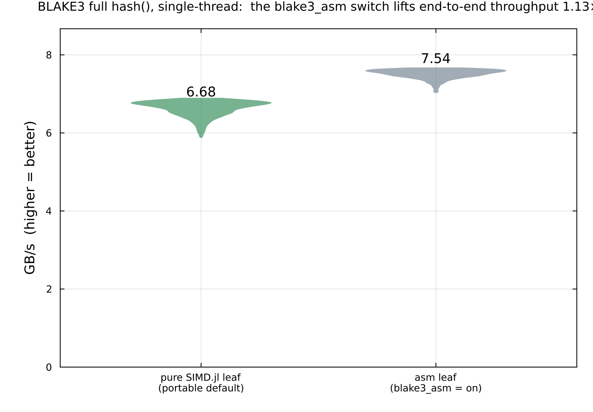

To force the portable pure path (e.g. for reproducible/portable builds), set the preference and restart:

```julia
using Preferences
set_preferences!(Base.UUID("6a76645a-1c79-4c35-96ac-450b50bde595"), "blake3_asm" => false)
```

The pure kernel remains the fallback whenever the asm is unavailable, so correctness never depends on the
toolchain. (Our earlier *hand-written* asm experiment — which had a subtle byte-exact bug, illustrating
asm's cost — lives on the `blake3-handasm` branch; the shipped switch uses blake3's vetted `.S` instead.)
Reproduce the whole comparison: `bench/probe_blake3_kernels.jl` (3-way kernel proof **+** the asm-switch
full-pipeline probe) and `bench/probe_blake3.jl` (full pipeline); `bench/plot_blake3_kernels.jl` regenerates
both plots from the saved JSON.

## simd-json → ⚠ moderate gap; stage-1 SIMD POC in a JSON.jl fork

Probed against **JSON.jl ≥ 1.6** (the rewrite — not the old 0.21.x). On the σ-clean structural comparison,
`JSON.isvalidjson` (a 0-alloc full scan) does **0.64 GB/s** while simd-json's `to_tape` does **0.98** —
so simd-json *builds a tape faster than Julia can merely validate*. Eager materialization is wider:
`JSON.parse → Dict` 0.19 vs simd-json's borrowed-value DOM 0.31 (these allocate, so they're GC-noisy;
`isvalidjson` is the clean number). A genuine but **moderate ~1.5× gap** — JSON.jl v1.6 already closed
most of what the old parser lost.

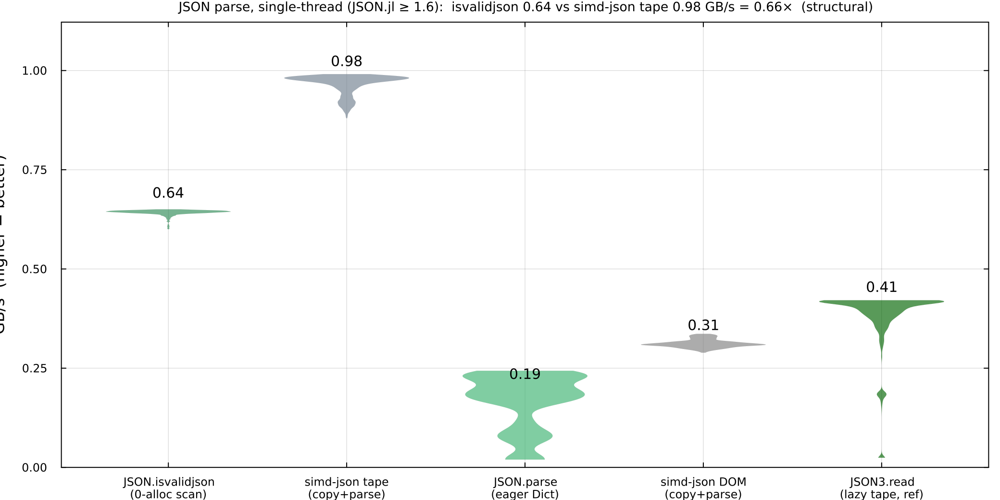

Rather than port a whole two-stage SIMD parser, we tested simdjson's **stage 1** where it fits JSON.jl's
lazy architecture: a `Vec{64,UInt8}` classifier (`<64 x i8>` AVX-512 `vpcmpb` + bitmask) replacing the
byte-by-byte scan for the end of a string. POC on a fork (`el-oso/JSON.jl`, branch
`strictmode-simd-stage1`): **the kernel is ~28× the scalar byte loop**, and end-to-end it's
**~4× faster than simd-json on long-string JSON** but ~10–16% slower on short-field JSON (string scanning
isn't the bottleneck there) — full size-sweep in the fork's `perf/string_scan_bench.md`. Byte-exact
(JSONTestSuite 283/283). The exercise also surfaced and **fixed a StrictMode bug (F32)**:
`@assert_no_scalar_loops` was blind to a scalar loop coexisting with vectorized code. Reproduce:
`bench/probe_simdjson.jl` → `bench/results/simdjson.json` → `bench/plot_simdjson.jl`.

## simdutf8 → `Utf8` — ✅ PORTED: pure-Julia SIMD validator, 6× Base on multibyte (+ StrictMode F33)

The probe found an 11× gap: Julia's `isvalid` SIMD-checks the ASCII fast-path but **falls to scalar the
moment multibyte appears** (1.65 vs simdutf8 17.7 GB/s). Unlike regex (PCRE2 is C) this is a genuine
*pure-Julia* gap — so we **ported it**: `BlazingPorts.Utf8.isvalid_utf8`, the lemire/simdjson algorithm
(three `pshufb` nibble-lookup tables + range checks via `Vec{16,UInt8}` `<16 x i8>` + an `llvmcall`
`pshufb` primitive). **Byte-exact with `Base.isvalid`** (~93k random + crafted cases: overlong, surrogate,
truncated, too-large, block-straddling). 16 MiB, single-thread:

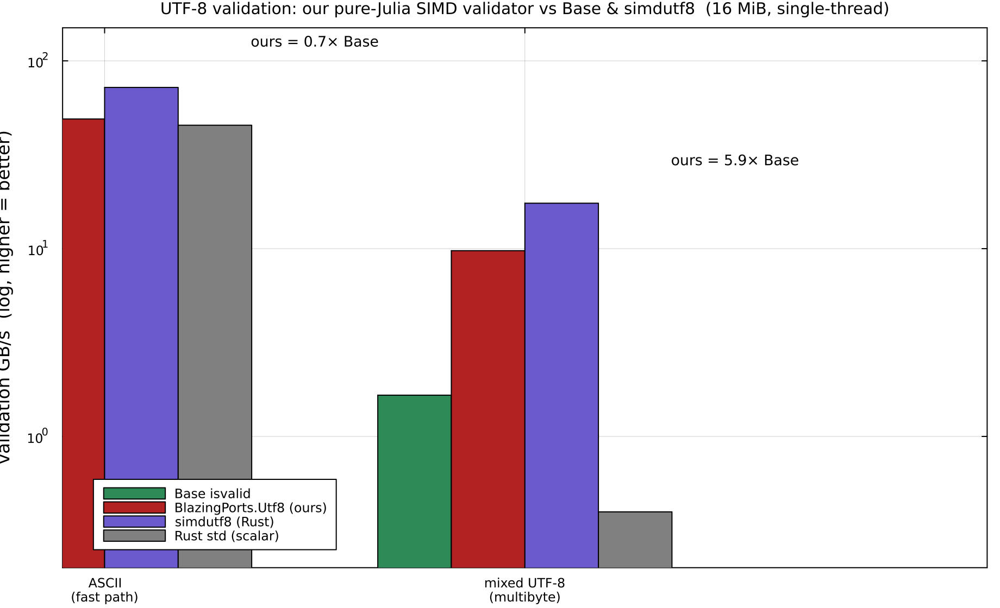

- **Mixed UTF-8 (multibyte): `isvalid_utf8` 9.8 vs Base 1.66 GB/s = 5.9× faster** (0.56× simdutf8 — the
  residual is SSE-16 vs its AVX2-32; an N=32 widening would roughly close it).
- **ASCII fast-path: ~parity** with Base (both bandwidth-bound; the chunked `movemask` ASCII check).

This is a SHUFFLE/LOOKUP kernel (≈0 arithmetic intensity), and auditing it produced **StrictMode F33**:
`kernel_report` counts FP/int arithmetic + memory ops but **not** the `pshufb` shuffles — the kernel's
actual work — so it mischaracterizes a perfectly-vectorized shuffle kernel ("balanced / try cache
blocking", irrelevant for a shuffle-port-bound kernel). The conjectured data-movement blind spot, confirmed.
Next: the same `pshufb` machinery folds straight into a **base64 / hex** SIMD library (the byte-ops cluster).

## byte-ops family (bytecount · base64 · hex · float-parse) → the shuffle-SIMD gap class

A batch probe of the rest of the "shuffle/lookup-SIMD" shortlist confirms a coherent pattern:

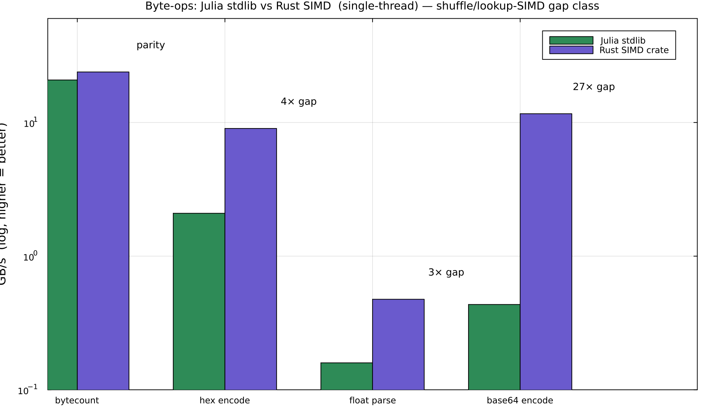

- **bytecount → parity.** `count(==(b), v)` 20.8 vs `bytecount` 23.9 GB/s = **0.87×**. A masked-compare +
  popcount reduction is exactly what LLVM auto-vectorizes, so Julia is already there. (An earlier *cold*
  reading of 2.7 GB/s was a measurement artifact — the warm median is fine.)
- **base64 encode → 27× gap.** `Base64.base64encode` 0.43 vs `base64-simd` 11.6 GB/s.
- **hex encode → 4.3× gap.** `bytes2hex` 2.09 vs `faster-hex` 9.02 GB/s.
- **float parse → 3× gap.** `parse(Float64,_)` 13 vs `lexical-core` 38 Mfloat/s (branchy parsing, not shuffle).

The lesson is sharp: **Julia matches Rust when LLVM can auto-vectorize the kernel (bytecount), but loses
4–27× on genuine `pshufb`-lookup/shuffle kernels** (base64, hex, and UTF-8 multibyte above) that LLVM won't
synthesize and Julia's stdlib codes scalar. Together these form a **coherent cluster**: a pure-Julia SIMD
byte-transcoding/validation library (utf8 + base64 + hex) would be both a real ecosystem contribution and the
ideal StrictMode shuffle-kernel feedback vehicle.

## regex / ripgrep → ⚠ large gap, but PCRE2(C)-vs-Rust (not Julia-vs-Rust)

Julia's `Regex` is **PCRE2** (a JIT'd C library); the Rust `regex` crate is a lazy-DFA with a Teddy/memchr
SIMD literal prefilter. Match throughput over an 8 MiB corpus (compile-once; the fair Julia baseline is an
allocation-free `Base.PCRE.exec` loop, since `eachmatch` allocates a match object per hit):

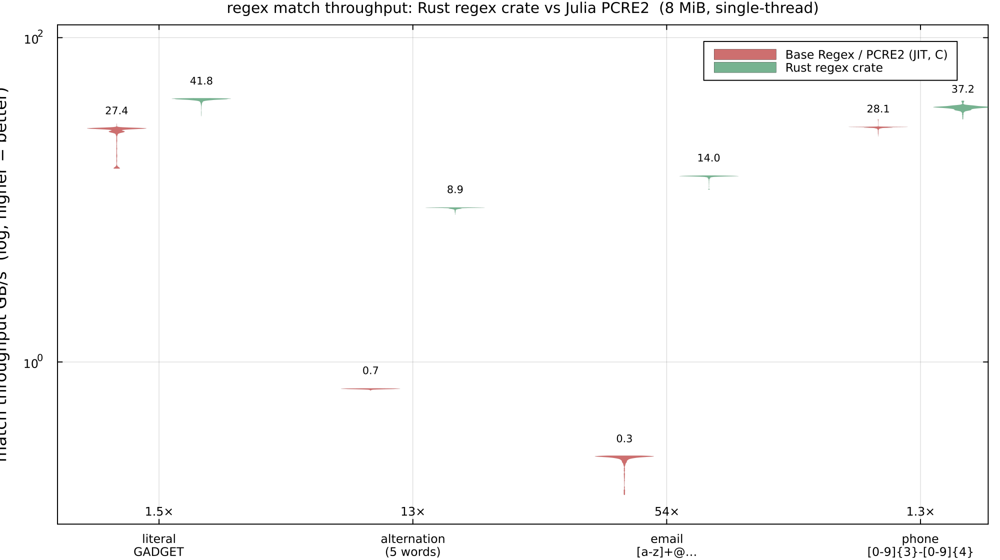

The crate wins **exactly where its architecture is built to**: **alternation** `(alpha|bravo|charlie|delta|echo)`
**13×** (Teddy multi-literal SIMD prefilter), and a **backtracking-prone pattern with a literal anchor**
`[a-z]{3,8}@[a-z]{3,8}\.com` **54×** (DFA — no backtracking — plus a prefilter on `@`/`.com`; PCRE2 backtracks
at every position). On simple patterns it's modest (literal `1.5×`, digit-class `1.3×`). A genuine, large gap —
but **faer-flavored: the baseline is PCRE2 (C), not Julia code**, so it's a C-lib-vs-Rust-lib gap, not a
language one. The "Julia answer" would be a pure-Julia DFA+prefilter engine (RE2/regex-crate class) — a massive
port with no competitive pure-Julia regex in the ecosystem. **Document-skip as a port; record the gap.**

## hashbrown → `SwissDict` — ⚖️ a fundamental trade-off

Reading Base's `dict.jl` reframed this: **Base `Dict` is already a SwissTable** (control bytes = h2,
SoA keys/vals) — only the *probe width* differs (scalar 1-slot vs SIMD 16). We ported a full
`SwissDict{K,V} <: AbstractDict` with a `Vec{16,UInt8}` group probe (TypeContracts-verified interface).

- **Result:** lookup-**miss 2.5× faster** than Base `Dict`; lookup-**hit 1.8× slower**. The SIMD probe
  derives the matching index *from* a reduction, so the value load serializes (no memory-level
  parallelism) — Base's scalar probe knows the address early. The mature `DataStructures.SwissDict`
  (group-aligned, prefetch-tuned) shows the **identical** profile, so it's inherent, not our bug.
- **Verdict:** a *miss-optimized* dict (membership / dedup / set-ops), not a clean win.

## ryu → skip (Base already ships Ryu)

Same DCE bug as itoa, fixed. Fairly, `Base.Ryu.writeshortest` (zero-alloc, Julia ships it) is **2.05×
faster** than the crate on integer-valued floats but **0.76–0.81×** on full-mantissa — value-dependent,
~parity overall. The residual is Base.Ryu's codegen, not the algorithm. Low ROI to port.

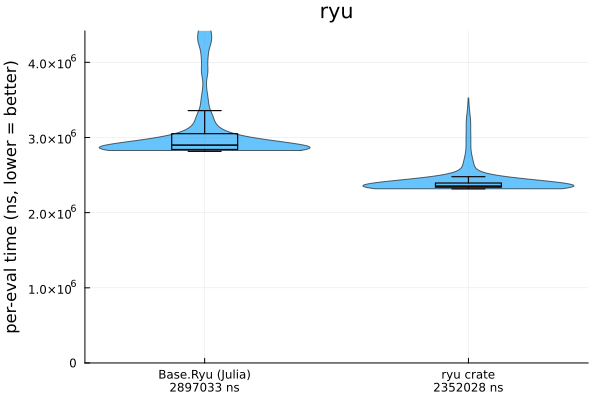

## roaring · bumpalo · fxhash · ahash → skip

- **roaring** (compressed bitsets) vs Base `BitSet`: the "38× dense" was build domination. Op-only,
  `BitSet` wins membership at every density (45× even sparse) and dense set-algebra; roaring wins only
  sparse-large union/intersect. Value-dependent — no port.
- **bumpalo** (arena allocator): `Bumper.jl` is the Julia analogue — parity at scale (both
  bandwidth-bound) and **zero GC allocations/call even at 1.1 GB**. No port.
- **fxhash**: Base `hash(::UInt64)` is at parity (0.92×). **ahash**: Base `hash` is **2.83× faster**
  (per-call hasher build dominates the AES advantage). Skip.
