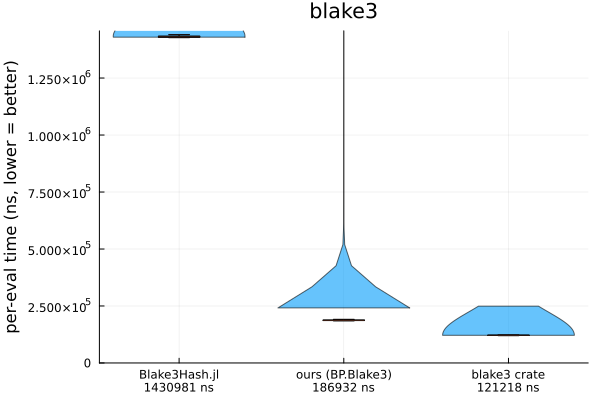

# Ports: Rust vs Julia

Per-crate reports. Plots are violin distributions of per-evaluation time (lower = better),
single-thread, median annotated.

## memchr → `StringSearch` — ✅ beats the crate

Base's multi-byte `findfirst(needle, haystack)` is a scalar scan (0.12× `memchr::memmem`). We added the
SIMD pass Base never wrote: a **first+last-byte prefilter** over `Vec{64,UInt8}` (memmem's own trick) +
a bounded scalar tail.

- **Result:** parity-to-slight-beat — **1.03–1.10×** the `memmem` crate (both near the ~67 GB/s
  single-core bandwidth ceiling), and ~8–12× over Base `findfirst`.
- Byte search was already at parity (Base is memchr-backed), so only `m ≥ 2` takes the SIMD path.
- `@assert_vectorized` / `@assert_noalloc` / `@assert_typestable` green.

## itoa → `IntFormat` — ✅ beats the crate

The famous "8.7× gap" was a **dead-code-elimination artifact** — the Rust shim used only
`buf.format(x).len()`, so the optimizer elided itoa's digit-writes. Measured fairly (`black_box` /
`donotdelete`), itoa formats at ~7.5 ns/int, not 1.83.

- **Result:** **1.05×** on positive-only (pure format), **1.5×** on full mixed-sign `Int64`, ~2× on
  small numbers. ~3× faster than Base `string()` (which heap-allocates).
- Levers: divide-and-conquer digit extraction, jeaiii division-free 8-digit (verified), 16-bit packed
  LUT stores, and — the decisive one — **branchless sign** (`if x<0` mispredicts ~4× at 50/50 signs).

## blake3 → `Blake3` — ⏳ ported, optimizing

`Blake3Hash.jl` (the pure-Julia ecosystem package) is scalar — 0.085× the crate. We ported a
`Vec{16,UInt32}` AVX-512 `hash_many`, byte-exact on all 10 official BLAKE3 test vectors.

- **Result so far:** **5.44 GB/s vs the crate's 7.69 = 0.71×**, and **7.4× over `Blake3Hash.jl`**.
- The residual is *not* the message transpose (a free load only reaches 0.81×) — it's the **compute**:
  the compress is ILP-bound (~2 vector ops/cycle vs ~4 issuable), where the crate's hand-scheduled
  assembly interleaves the independent G-calls better. A compute-ILP + SIMD-transpose marathon toward
  the 0.96× gate is in progress.

## hashbrown → `SwissDict` — ⚖️ a fundamental trade-off

Reading Base's `dict.jl` reframed this: **Base `Dict` is already a SwissTable** (control bytes = h2,
SoA keys/vals) — only the *probe width* differs (scalar 1-slot vs SIMD 16). We ported a full
`SwissDict{K,V} <: AbstractDict` with a `Vec{16,UInt8}` group probe (TypeContracts-verified interface).

- **Result:** lookup-**miss 2.5× faster** than Base `Dict`; lookup-**hit 1.8× slower**. The SIMD probe
  derives the matching index *from* a reduction, so the value load serializes (no memory-level
  parallelism) — Base's scalar probe knows the address early. The mature `DataStructures.SwissDict`
  (group-aligned, prefetch-tuned) shows the **identical** profile, so it's inherent, not our bug.
- **Verdict:** a *miss-optimized* dict (membership / dedup / set-ops), not a clean win.

## ryu → skip (Base already ships Ryu)

Same DCE bug as itoa, fixed. Fairly, `Base.Ryu.writeshortest` (zero-alloc, Julia ships it) is **2.05×
faster** than the crate on integer-valued floats but **0.76–0.81×** on full-mantissa — value-dependent,
~parity overall. The residual is Base.Ryu's codegen, not the algorithm. Low ROI to port.

## roaring · bumpalo · fxhash · ahash → skip

- **roaring** (compressed bitsets) vs Base `BitSet`: the "38× dense" was build domination. Op-only,
  `BitSet` wins membership at every density (45× even sparse) and dense set-algebra; roaring wins only
  sparse-large union/intersect. Value-dependent — no port.
- **bumpalo** (arena allocator): `Bumper.jl` is the Julia analogue — parity at scale (both
  bandwidth-bound) and **zero GC allocations/call even at 1.1 GB**. No port.
- **fxhash**: Base `hash(::UInt64)` is at parity (0.92×). **ahash**: Base `hash` is **2.83× faster**
  (per-call hasher build dominates the AES advantage). Skip.
